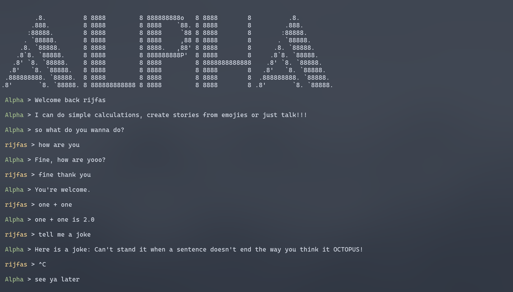
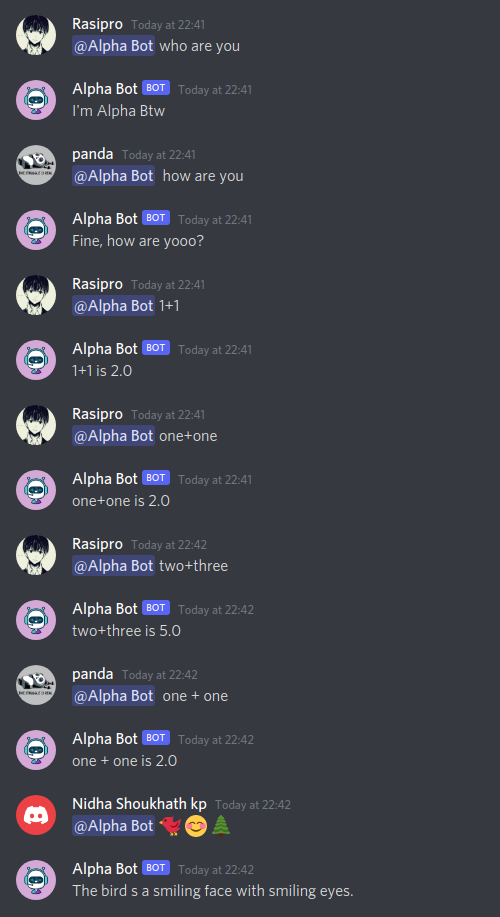

<!-- PROJECT LOGO -->
<br />
<p align="center">
  <a href="https://github.com/rijfas/saturday-hack-night-dialogflow">
    
  </a>

  <h3 align="center">Alpha Bot</h3>

  <p align="center">
    Simple virtual friend lives in your cli (now in discord bot too)!
    <br />
    <a href="https://github.com/rijfas/saturday-hack-night-dialogflow"><strong>Explore the docs »</strong></a>
    <br />
    <br />
    <a href="https://discord.com/oauth2/authorize?client_id=868410422536052786&scope=bot">Add to your discord server</a>
    ·
    <a href="https://github.com/github.com/rijfas/saturday-hack-night-dialogflow/issues">Report Bug</a>
    ·
    <a href="https://github.com/github.com/rijfas/saturday-hack-night-dialogflow/issues">Request Feature</a>
  </p>
</p>


<!-- TABLE OF CONTENTS -->
<details open="open">
  <summary>Table of Contents</summary>
  <ol>
    <li>
      <a href="#about-the-project">About The Project</a>
      <ul>
        <li><a href="#built-with">Built With</a></li>
      </ul>
    </li>
    <li>
      <a href="#getting-started">Getting Started</a>
      <ul>
        <li><a href="#prerequisites">Prerequisites</a></li>
        <li><a href="#installation">Installation</a></li>
      </ul>
    </li>
    <li><a href="#usage">Usage</a></li>
    <li><a href="#roadmap">Roadmap</a></li>
    <li><a href="#contributing">Contributing</a></li>
    <li><a href="#license">License</a></li>
    <li><a href="#contact">Contact</a></li>
    <li><a href="#contributers">Contributers</a></li>
  </ol>
</details>


<!-- ABOUT THE PROJECT -->
## About The Project
### CLI Example
---


<br>
<br>

### Discord Example
---



Alpha bot is a virtual friend who does simple calculations,crack jokes,tell to stories and also give you a great chitchat.Alpha bot is purely built with python.
You could deploy him as discord bot or CLI tool

Here's why:
* It keeps your discord server alive.
* It gives you relief when you get weird by errors
* It also give you a great talk
 

A list of commonly used resources that I find helpful are listed in the acknowledgements.

### Built With

This section should list any major frameworks that you built your project using. Leave any add-ons/plugins for the acknowledgements section. Here are a few examples.
* [Python](https://www.python.org/)
* [Flask](https://flask.palletsprojects.com/)
* [Replit](https://replit.com/)
* [DialogFlow](https://dialogflow.cloud.google.com/#/getStarted)
* [UptimeRobot](https://uptimerobot.com/)


<!-- GETTING STARTED -->
## Getting Started

This is an example of how you may give instructions on setting up your project locally.
To get a local copy up and running follow these simple example steps.

### Prerequisites

This is an example of how to list things you need to use the software and how to install them.

### Installation

1. Clone the repo
   ```sh
   git clone https://github.com/rijfas/saturday-hack-night-dialogflow.git
   ```
3. Install required packages
   ```sh
   pip install -r requirements.txt
   ```
4. Enter your API in `config.py`
   ```py
   API_URL = 'YOUR API URL'
   ```


<!-- USAGE EXAMPLES -->
## Usage

You can just run the cli tool or use a cloud system to deploy the bot.


<!-- ROADMAP -->
## Roadmap

See the [open issues](https://github.com/othneildrew/Best-README-Template/issues) for a list of proposed features (and known issues).


<!-- CONTRIBUTING -->
## Contributing

Contributions are what make the open source community such an amazing place to be learn, inspire, and create. Any contributions you make are **greatly appreciated**.

1. Fork the Project
2. Create your Feature Branch (`git checkout -b feature/AmazingFeature`)
3. Commit your Changes (`git commit -m 'Add some AmazingFeature'`)
4. Push to the Branch (`git push origin feature/AmazingFeature`)
5. Open a Pull Request


<!-- LICENSE -->
## License

Distributed under the MIT License. See `LICENSE` for more information.


<!-- CONTACT -->
## Contact

Your Name - [@rijfas](https://twitter.com/your_username) - rijfas01@gmail.com

Project Link: [https://github.com/rijfas/saturday-hack-night-dialogflow](https://github.com/rijfas/saturday-hack-night-dialogflow)


<!-- CONTRIBUTERS -->
## Contributers
* [Amjad CP](https://github.com/amjadcp)
* [Rijfas](https://github.com/rijfas)
* [Nidha Shoukath](https://github.com/nidhashoukhath)
* [Rasil](https://github.com/rasilkp/rasilkp)


