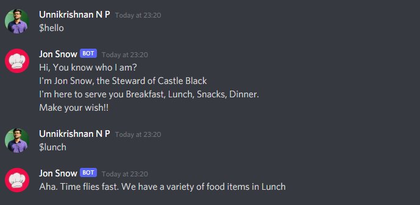

## Jon Snow Bot (Dialogflow/56)
This a short project done in association with Saturday Hack Night conducted by TinkerHub Foundation

## Techs Used

- [Python](https://www.python.org/)
- [Dialogflow API](https://cloud.google.com/dialogflow/es/docs/reference/rest/v2-overview)
- [UptimeRobot](https://uptimerobot.com/)
- [Replit](https://replit.com/~)
- [Flask](https://flask.palletsprojects.com/en/2.0.x/)
- Youtube and Our Brains 😅 

## About Jon Snow!!

Jon Snow is a discord bot which allows the users to order their favorite food items to the list. 
This bot is still under development and also have many bugs. 

## How it works!!

- Add this bot to your server via the link given below
- NB : If you want to interact with the bot add a '$' symbol before the command

##  Example Commands: 
- $ (just tell it you are hungry or just ask who is this. It will respond)
- $ (hi,hello etc)
- $ (food time like breakfast,lunch, dinner etc)
- $ (just ask send me menu)
- $ (According to the food time you choose type the comamand for eg : $meals if you choose lunch)
  
---

---

[Click here to add this bot to your server](https://discord.com/oauth2/authorize?client_id=868480795667476480&scope=bot)

## Participants
- [Aflah V K](https://github.com/AFLAH2527)
- [Adil Ayyoob](https://github.com/Adilayyoob)
